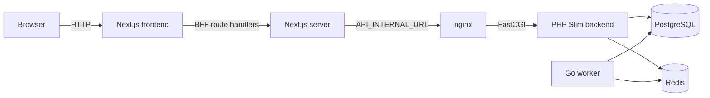

# Gift Certificates Platform

[](https://github.com/zenamons-s/full-stack-sertificat/actions/workflows/ci.yml)

Full-stack платформа управления подарочными сертификатами.

- PHP backend отвечает за API, аутентификацию и бизнес-правила сертификатов.
- Go worker переводит просроченные сертификаты в `expired`.
- Next.js frontend работает через BFF: браузерный JavaScript не получает JWT.
- PostgreSQL хранит данные пользователей, сертификаты и аудит.
- Redis используется для кеша списков, rate limit, denylist refresh-токенов и инвалидации поколения кеша.

Стек:

- PHP 8.3, Slim 4;
- Go 1.22;
- Next.js 15;
- PostgreSQL 16;
- Redis 7;
- Docker Compose.

## 2. Быстрый запуск

Запуск с чистого клона одной командой:

```bash
cp .env.example .env && docker compose up -d --build
```

Первый запуск может занять 1-2 минуты: собираются образы, выполняются миграции, seed и стартуют healthcheck.

Ожидаемый результат:

- `postgres`, `redis`, `backend`, `nginx`, `worker`, `frontend` - `healthy`;
- `migrator` - `Exited (0)`.

Полный сброс и повторный запуск:

```bash
docker compose down -v --remove-orphans
docker compose up -d --build
```

`docker compose down -v` удаляет volume PostgreSQL, то есть все локальные данные.

## 3. Тестовые учётные данные

Seed создаёт локального пользователя:

```text
Email: admin@example.com
Password: Password123!
```

Для production значения в `.env` необходимо заменить. `JWT_SECRET`, пароли БД и служебные пароли не публикуются в README как готовые production-секреты.

## 4. Основные URL

| Назначение | URL |
|---|---|
| Frontend | http://localhost:3000 |
| Login | http://localhost:3000/login |
| Certificates | http://localhost:3000/certificates |
| Backend API | http://localhost:8080/api/v1 |
| API health | http://localhost:8080/api/v1/health |
| Swagger UI | http://localhost:8080/docs |
| Frontend health | http://localhost:3000/api/health |
| OpenAPI | `docs/openapi.yaml` |

## 5. Возможности

Реализовано:

- JWT login и refresh;
- хранение токенов в httpOnly cookies через Next.js BFF;
- просмотр списка сертификатов;
- поиск по названию;
- фильтрация по статусу;
- сортировка;
- пагинация;
- создание сертификата;
- редактирование сертификата;
- optimistic locking через поле `version`;
- мягкое удаление;
- восстановление из корзины;
- аудит изменений;
- Redis-кеш списков с ключом-поколением;
- автоматическое истечение сертификатов через Go worker;
- healthcheck сервисов;
- Docker Compose запуск с нуля.

HTTP/UI-действий для `redeemed` и `cancelled` сейчас нет в OpenAPI и интерфейсе.

## 6. Архитектура



Браузер работает только с Next.js. JWT хранится в httpOnly cookie, поэтому client-side React-код не читает access/refresh token.

Frontend server-side и BFF handlers обращаются к backend через `API_INTERNAL_URL=http://nginx/api/v1`. Backend разделён на `Domain`, `Application`, `Infrastructure` и `Http`. Worker работает через интерфейс `Expirer` и имеет реализации `db` и `api`; основной проверенный режим - `SYNC_MODE=db`.

## 7. Структура репозитория

```text
backend/
  src/Domain
  src/Application
  src/Infrastructure
  src/Http
  migrations/
  tests/
worker/
  cmd/expirer
  internal/
frontend/
  src/app
  src/components
  src/lib
docker/
docs/openapi.yaml
docker-compose.yml
```

- `backend/` - PHP API, миграции, seed и консольные команды.
- `worker/` - Go-сервис истечения сертификатов и его unit-тесты.
- `frontend/` - Next.js UI, BFF route handlers, middleware и frontend-тесты.
- `docker/` - конфигурация nginx и PostgreSQL init.
- `docs/openapi.yaml` - контракт backend API и источник генерации frontend-типов.
- `docker-compose.yml` - локальная сборка и запуск всех сервисов.

## 8. Модель данных

Основные таблицы:

- `users` - пользователи и хеши паролей;
- `certificates` - сертификаты;
- `certificate_audit` - история изменений сертификатов.

Для `certificates`:

- деньги хранятся в `price_minor bigint`, без float;
- время хранится в UTC в `timestamptz`;
- `status`: `active`, `expired`, `redeemed`, `cancelled`;
- `version` используется для optimistic locking;
- `deleted_at` реализует soft delete.

Ключевые индексы:

- partial index для sweep worker по active-просроченным сертификатам;
- status/list indexes для листинга;
- trigram index для поиска по `title`;
- audit index по `certificate_id` и `created_at`.

## 9. Машина состояний

| Переход | Кто выполняет | Разрешён |
|---|---|---|
| создание -> active | backend | да |
| active -> expired | Go worker | да |
| expired -> active | backend при продлении | да |
| active -> redeemed | доменное действие | предусмотрено моделью |
| active -> cancelled | доменное действие | предусмотрено моделью |
| redeemed/cancelled -> другой статус | - | нет |

Правила:

- `status` не принимается напрямую из create/update запросов;
- `redeemed` и `cancelled` терминальны;
- чтение и фильтры используют сохранённый `status`, без вычисления истечения на чтении;
- возможна eventual consistency до `WORKER_INTERVAL`.

HTTP endpoints `redeem` и `cancel` в текущем OpenAPI отсутствуют.

## 10. Сценарий проверки за 5 минут

1. Запуск:

```bash
cp .env.example .env
docker compose up -d --build
docker compose ps
```

2. Проверка health:

```bash
curl http://localhost:8080/api/v1/health
curl http://localhost:3000/api/health
```

Ожидаемая структура ответов:

```json
{"status":"ok","db":"ok","redis":"ok","version":"0.1.0"}
```

```json
{"status":"ok","service":"frontend"}
```

3. Вход:

Открыть http://localhost:3000/certificates. Ожидается редирект на login.

Войти:

```text
admin@example.com
Password123!
```

4. CRUD и аудит:

Проверить создание сертификата, редактирование, удаление с подтверждением, отображение удалённых и восстановление. На странице редактирования есть блок «История изменений»: для ручных действий в нём виден `actor_type=user`.

5. Работа worker:

```bash
docker compose logs -f worker
```

В seed есть 5 записей с прошедшей датой и `status=active`. При первом чистом запуске в логах ожидаются сообщения:

```text
worker started
expiration batch completed
expiration run completed
```

SQL-проверка expired:

```bash
docker compose exec postgres psql -U app -d certificates -c \
  "SELECT count(*) FROM certificates WHERE status='expired' AND deleted_at IS NULL;"
```

Ожидается `5` после первого прогона worker.

SQL-проверка audit:

```bash
docker compose exec postgres psql -U app -d certificates -c \
  "SELECT count(*) FROM certificate_audit WHERE actor_type='worker' AND action='expired';"
```

Ожидается `5`. Повторный цикл worker должен найти 0 новых записей.

После обновления страницы сертификаты с прошедшей датой отображаются как `expired`. Если открыть редактирование одного из них, в блоке «История изменений» будет запись `action=expired` и `actor_type=worker`.

## 11. Команды разработчика

Backend:

```bash
cd backend
composer install
vendor/bin/phpstan analyse
vendor/bin/phpunit
composer audit --no-dev
```

Миграции и seed:

```bash
cd backend
php bin/console migrate
php bin/console migrate:status
php bin/console migrate:rollback
php bin/console seed
```

В Docker:

```bash
docker compose run --rm migrator php bin/console migrate:status
docker compose run --rm migrator php bin/console seed
docker compose run --rm --build backend-dev vendor/bin/phpstan analyse --no-progress
docker compose run --rm --build backend-dev vendor/bin/phpunit
```

Worker:

```bash
cd worker
go test ./...
go test -race ./...
go vet ./...
golangci-lint run
```

Frontend:

```bash
cd frontend
npm ci
npm run generate:api
npm run lint
npx tsc --noEmit
npx vitest run
npm run build
```

Docker:

```bash
docker compose config
docker compose build
docker compose logs -f
```

## 12. Переменные окружения

Переменные берутся из `.env`; пример находится в `.env.example`.

Database:

- `POSTGRES_DB`, `POSTGRES_USER`, `POSTGRES_PASSWORD` - локальная БД в compose.
- `DATABASE_URL` - DSN для backend, migrator и worker.

Backend/JWT:

- `APP_ENV` - режим приложения.
- `JWT_SECRET` - секрет подписи JWT, должен быть заменён для production.
- `JWT_ACCESS_TTL`, `JWT_REFRESH_TTL` - срок жизни access и refresh токенов.
- `SEED_USER_EMAIL`, `SEED_USER_PASSWORD` - данные demo-пользователя.

Redis/cache:

- `REDIS_URL` - адрес Redis.
- `CACHE_TTL` - TTL кеша списков сертификатов; инвалидация дополнительно идёт через generation key.

Worker:

- `WORKER_INTERVAL` - период запуска цикла истечения.
- `WORKER_BATCH_SIZE` - размер батча обработки.
- `WORKER_ADVISORY_LOCK_ID` - id PostgreSQL advisory lock для защиты от параллельных worker.
- `SYNC_MODE` - режим `db` или `api`; основной и проверенный режим - `SYNC_MODE=db`.
- `API_BASE_URL`, `WORKER_API_EMAIL`, `WORKER_API_PASSWORD` - нужны для альтернативного `SYNC_MODE=api`.
- `LOG_LEVEL` - уровень JSON-логов worker.

Frontend:

- `API_INTERNAL_URL` - внутренний URL backend API для Next.js server-side/BFF.
- `NEXT_PUBLIC_APP_URL` - публичный URL frontend.

`SYNC_MODE=api` реализован как альтернативный адаптер, но отдельный E2E-прогон этого режима пока не подтверждён.

## 13. ADR — архитектурные решения

### ADR-1. Материализованный status вместо вычисления на чтении

Контекст. Нужны фильтры по статусу и отдельный worker, который меняет `active` на `expired`.

Решение. `status` хранится в БД и является источником истины для чтения.

Альтернативы. Вычислять `expired` на каждом чтении или через view.

Последствия. Поведение worker видно в данных и UI, но есть окно eventual consistency.

### ADR-2. Eventual consistency до WORKER_INTERVAL

Контекст. Сертификат может истечь между циклами worker.

Решение. Листинг показывает сохранённый `status`; переход выполняет worker по расписанию.

Альтернативы. Вычислять истечение в API.

Последствия. UI может отставать до `WORKER_INTERVAL`, зато правило истечения живёт в одном месте.

### ADR-3. Worker напрямую в БД; REST adapter как альтернатива

Контекст. Массовое истечение требует батчей, транзакций и блокировок.

Решение. Основной режим `db` использует PostgreSQL напрямую; `api` вынесен в отдельный адаптер за интерфейсом `Expirer`.

Альтернативы. Только REST-запросы к backend.

Последствия. `db` режим проще сделать атомарным и быстрым, но worker знает минимальную часть схемы.

### ADR-4. expired -> active только через продление

Контекст. Истёкший сертификат может получить новую будущую дату.

Решение. Возврат `expired -> active` разрешён только при продлении срока.

Альтернативы. Сделать `expired` терминальным или разрешить свободный `setStatus`.

Последствия. Статус остаётся следствием доменного действия, а не полем формы.

### ADR-5. Slim вместо Laravel/Symfony full-stack

Контекст. Важно показать разделение слоёв, а не использовать тяжёлый framework skeleton.

Решение. Backend построен на Slim 4, PHP-DI и DBAL.

Альтернативы. Laravel или Symfony full-stack.

Последствия. Больше явного кода инфраструктуры, но границы Domain/Application/Infrastructure/Http видны в репозитории.

### ADR-6. Деньги в minor units

Контекст. Стоимость нельзя хранить и считать через float.

Решение. Цена хранится как `price_minor bigint` плюс `currency`.

Альтернативы. `float`, `decimal` или строковые суммы.

Последствия. Нет потери точности; форматирование выполняется на краях системы.

### ADR-7. Optimistic locking через version и конфликт с worker

Контекст. Пользователь и worker могут менять одну запись конкурентно.

Решение. `PATCH` требует `version`; update выполняется с условием по версии.

Альтернативы. Last write wins или pessimistic lock на время формы.

Последствия. При конфликте API возвращает `409` и актуальное состояние.

### ADR-8. Redis generation key вместо KEYS/SCAN

Контекст. Инвалидировать кеш должны backend и worker.

Решение. Ключи списков включают `certificates:gen`; мутация делает `INCR`.

Альтернативы. Удалять ключи через `KEYS`/`SCAN`.

Последствия. Инвалидация O(1), старые ключи истекают по TTL.

### ADR-9. Redis cache как optional dependency

Контекст. Потеря Redis не должна ронять CRUD/API.

Решение. Ошибки Redis логируются, запрос идёт в БД; health показывает `redis=degraded`.

Альтернативы. Считать Redis обязательной зависимостью API.

Последствия. При деградации падает производительность, но основной функционал доступен.

### ADR-10. httpOnly cookie/BFF вместо localStorage

Контекст. JWT в `localStorage` доступен при XSS.

Решение. Login/refresh идут через Next.js Route Handlers, токены кладутся в httpOnly cookies.

Альтернативы. Хранить токены в `localStorage` или отдавать их React-коду.

Последствия. Браузерный JS не видит JWT; мутации проходят через BFF.

### ADR-11. Soft delete, partial indexes и audit без FK

Контекст. Нужны корзина, аудит и быстрые выборки живых записей.

Решение. Используется `deleted_at`, partial indexes по живым данным и audit-таблица, не блокирующая удаление бизнес-записей FK.

Альтернативы. Жёсткое удаление или глобальные индексы без условия.

Последствия. История сохраняется, листинг не обязан фильтровать `deleted_at` вручную вне репозитория.

## 14. Безопасность

- JWT не хранится в `localStorage` или `sessionStorage`.
- Cookies с токенами выставляются как httpOnly, `SameSite=Lax`, `Secure` в production.
- Пароли хешируются Argon2id.
- Backend в production не раскрывает stack trace.
- `request_id` проходит через Problem Details и логи.
- Сортировка ограничена whitelist из OpenAPI/кода.
- `status` нельзя передать в create/update.
- Секреты хранятся в `.env`, который игнорируется Git.
- Полноценной RBAC сейчас нет; seed создаёт demo-пользователя и служебный аккаунт worker.

## 15. Отказоустойчивость

Фактически предусмотрено в коде и compose:

- Redis остановлен: backend health показывает degraded, list/CRUD продолжают работать через БД.
- Backend остановлен: frontend `/api/health` остаётся 200, страницы приложения показывают ошибочное состояние вместо белого экрана.
- Worker при ошибке БД логирует ошибку и повторяет попытку в следующем цикле.
- PostgreSQL advisory lock защищает от параллельной обработки несколькими worker.
- `FOR UPDATE SKIP LOCKED` защищает батчи при конкурентной обработке.

## 16. Известные ограничения

- `SYNC_MODE=api` реализован, но отдельным E2E-прогоном не подтверждён. Переключение режима в compose требует правки `.env` и пересоздания worker-контейнера, а не разовой shell-переменной перед командой.
- Нет полноценной RBAC и управления пользователями.
- Нет HTTP/UI действий `redeem` и `cancel`; статусы предусмотрены моделью.
- Нет Playwright/E2E browser automation.
- Frontend npm audit не зафиксирован в репозитории как пройденная проверка.
- Демонстрационный интерфейс требует финальной UX-полировки и полной локализации статусов.
- Проект использует один compose-файл без отдельной production orchestration.

## 17. Что бы я сделал дальше

В первую очередь — для продакшена:

- E2E-тесты на Playwright. Сейчас браузерный слой проверяется вручную; нужны сценарии login, CRUD, conflict resolution и видимость работы worker через UI.
- Observability: метрики Prometheus и трейсинг. Структурные JSON-логи уже есть в backend и worker, но нет метрик latency/error rate, длительности sweep и размера батчей.
- Secret manager и TLS. Сейчас локальный запуск использует `.env`; для production секреты должны уйти в управляемое хранилище, а внешний контур должен работать только по HTTPS.

Функциональное развитие:

- Явные действия `redeem` и `cancel`. Машина состояний в домене готова, но не хватает HTTP endpoints, OpenAPI-операций и UI-кнопок с подтверждением.
- Ротация сессий refresh-токенов. Базовая ротация через denylist `jti` уже есть; следующий шаг — хранить сессии, устройства, время последнего использования и принудительный logout.

При росте команды и данных:

- RBAC и мультипользовательский режим. Схема уже содержит `created_by`, а аудит — `actor_id`; нужно добавить роли, правила доступа и фильтрацию данных по владельцу/организации.
- Партиционирование аудита по дате. Текущая таблица аудита достаточна для небольшого объёма; при росте записей её стоит партиционировать и настроить retention policy.

## 18. Оценка времени и MVP-тег

Тег `v0.1-mvp` существует и указывает на тот же commit, что `phase-7`: `3f5bac4 chore: production Docker integration and healthchecks (phase 7)`.

Базовая функциональность завершена к тегу `v0.1-mvp`. Бонусные пункты выполнялись сверх базового временного лимита. Проект сознательно расширен OpenAPI, кешем, аудитом, soft delete и альтернативным worker adapter.

## 19. Лицензия

Лицензия не выбрана. Проект выполнен как тестовое задание.
